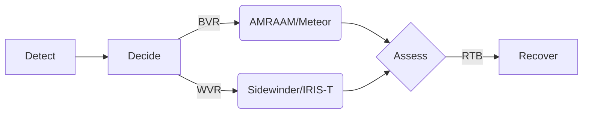
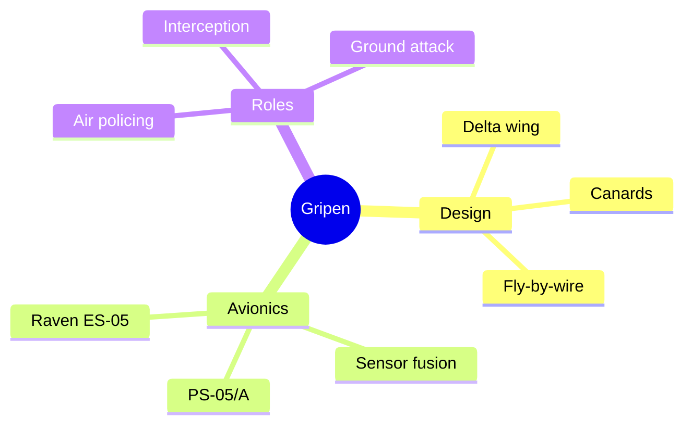

# Saab JAS 39 Gripen — Markdown Showcase
> A single-file demo that exercises many Markdown features using the **Saab JAS 39 Gripen** as the topic.

[](https://en.wikipedia.org/wiki/Saab_JAS_39_Gripen)
[](#licenses)
[](#overview)

---

## Table of Contents
- [Overview](#overview)
- [Quick Facts](#quick-facts)
- [Images](#images)
- [Design Highlights](#design-highlights)
- [Operators](#operators)
- [Variants Table](#variants-table)
- [Callouts](#callouts)
- [Lists & Task Lists](#lists--task-lists)
- [Links](#links)
- [Code Blocks](#code-blocks)
- [Mermaid Diagrams](#mermaid-diagrams)
- [Blockquotes](#blockquotes)
- [Footnotes](#footnotes)
- [HTML in Markdown](#html-in-markdown)
- [References (Link-Style)](#references-link-style)
- [Licenses](#licenses)

---

## Overview
The **Saab JAS 39 Gripen** (pronounced */ˈɡriːpɛn/*) is a light, single‑engine, **supersonic** multirole fighter aircraft developed by **Saab AB** of Sweden. It uses a **delta‑canard** layout with **relaxed stability** and **fly‑by‑wire** controls, and is fully interoperable with **NATO** systems.[^src]

> **JAS** stands for **J**akt (fighter), **A**ttack, **S**paning (reconnaissance).

---

## Quick Facts
**First flight:** 9 Dec 1988  
**Entered service:** 9 Jun 1996  
**Roles:** Multirole (air‑to‑air, air‑to‑surface, reconnaissance)  
**Powerplant:** Volvo RM12 (license‑built GE F404)  
**Configuration:** Delta wing + close‑coupled canards

---

## Images

### Photo (Public Domain)


*Caption:* Swedish Air Force **JAS 39 Gripen** arriving for Exercise *Cooperative Key 2003* at **Graf Ignatievo AB**, Bulgaria. *Public domain (U.S. federal government).*

### Orthographic 3‑view (SVG)


*Caption:* 3‑view diagram of the Gripen. © *Kaboldy* (CC BY‑SA 3.0).

---

## Design Highlights
- **Delta‑canard aerodynamics** provide lift, agility, and short‑field performance.
- **Relaxed stability** with **digital fly‑by‑wire** improves maneuverability.
- **Sensor fusion** and modular avionics allow upgrades across the lifecycle.
- **PS‑05/A radar** on early variants; **Raven ES‑05 AESA** + **Skyward‑G IRST** on later E/F.
- Designed for **dispersed operations** (e.g., Sweden’s Bas 90 road bases).

> [!NOTE]
> Later aircraft are *fully NATO interoperable* and can carry modern weapons such as **AMRAAM** and **Meteor**.

---

## Operators
- **Sweden**, **Brazil**, **Hungary**, **South Africa**, **Thailand** (C/D, E/F programs vary).
- Deployed for **air policing** and **quick reaction alert** by several air forces.

> [!TIP]
> Countries often select the Gripen for a **lower operating cost** profile and robust **turnaround** from austere locations.

---

## Variants Table
| Variant | Seats | Notable Features |
|---|:---:|---|
| **A/B** | 1/2 | Early production; PS‑05/A radar; national service entry. |
| **C/D** | 1/2 | NATO interoperability; inflight refuelling; updated avionics. |
| **E/F** | 1/2 | *Gripen E-series*: new engine, increased payload, ES‑05 AESA, Skyward‑G IRST, updated EW suite. |

<sub>*Values are simplified for demo purposes.*</sub>

---

## Callouts
> [!IMPORTANT]
> **Dispersed basing:** Gripen was designed for short road operations with rapid turnaround.

> [!WARNING]
> **Licensing:** Images below carry different licenses (Public Domain vs CC BY‑SA). Verify before reuse.

> [!NOTE]
> This document demonstrates *Markdown syntax*, not an authoritative spec sheet.

---

## Lists & Task Lists

**Unordered list**
- Multi‑role capability
- Data link integration
- Modular avionics

**Ordered list**
1. Detect
2. Engage
3. Egress

**Task list**
- [x] Add images (photo + SVG)
- [x] Include tables and callouts
- [x] Provide link references
- [ ] Add localized translations

---

## Links
- Inline link to **Wikipedia**: https://en.wikipedia.org/wiki/Saab_JAS_39_Gripen  
- Autolink: <https://www.saab.com/products/gripen-e-series>  
- Reference‑style link: see [Gripen (Wikipedia)][wikipedia] and [3‑view SVG][threeview].

---

## Code Blocks

### Shell
```bash
# Fetch the Wikipedia page HTML
curl -L "https://en.wikipedia.org/wiki/Saab_JAS_39_Gripen" -o gripen.html
```

### JSON
```json
{
  "aircraft": "Saab JAS 39 Gripen",
  "roles": ["fighter", "attack", "reconnaissance"],
  "variants": ["A/B", "C/D", "E/F"],
  "engine": "Volvo RM12 (GE F404-derived)"
}
```

### YAML
```yaml
aircraft: Saab JAS 39 Gripen
first_flight: 1988-12-09
entered_service: 1996-06-09
configuration:
  wing: delta
  canards: true
```

---

## Mermaid Diagrams

### Flowchart


### Mindmap


---

## Blockquotes
> “According to Saab, the Gripen provides *lower operating costs* than competitors.”

---

## Footnotes
The Gripen is named after the **griffin**, also used on Saab’s heraldry.[^name]

[^name]: *Gripen* is Swedish for **griffin**.
[^src]: Source text and facts adapted from the Wikipedia article on the Saab JAS 39 Gripen.

---

## HTML in Markdown
You can mix in small amounts of HTML when needed:<br/>
<small>Example: Inline pronunciation, superscripts (m²), or responsive images.</small>

---

## References (Link-Style)
- [wikipedia]: https://en.wikipedia.org/wiki/Saab_JAS_39_Gripen "Saab JAS 39 Gripen — Wikipedia"
- [threeview]: https://commons.wikimedia.org/wiki/File:Saab_JAS_39_Gripen_3-view.svg "Wikimedia Commons"

---

## Licenses
- **Photo:** *Swedish JAS‑39 Gripen landing* — U.S. Air Force photo, **public domain** in the U.S. (see file page).  
  File page: https://commons.wikimedia.org/wiki/File:Swedish_JAS-39_Gripen_landing.jpg

- **3‑view SVG:** © *Kaboldy*, **CC BY‑SA 3.0**.  
  File page: https://commons.wikimedia.org/wiki/File:Saab_JAS_39_Gripen_3-view.svg

- **Text:** This doc summarizes material from Wikipedia (CC BY‑SA). Attribute and link to the original article when reusing.

---

*End of Markdown showcase.*
